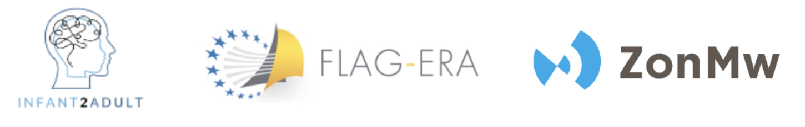

Interactive application for visualizing whole-brain surface vertex-wise statistical maps.
The app generates **3D brain surface maps** based on a given results directory. 
The results directory should contain the output generated using [`verywise`](https://seredef.github.io/verywise/index.html) (or `QDECR`).

You can try the application online [here](https://seredef-verywise-wizard.share.connect.posit.cloud/).

### Running the application locally 
The 3D brain surface reconstructions (especially the high-resolution ones) may be faster to generate on your local machine. 
To run the application locally (on a UNIX system with Python 3.9 installed), run the following lines into your terminal:
```
git clone https://github.com/SereDef/verywise-wizard

cd verywise-wizard
pip install -r requirements.txt

shiny run --launch-browser app.py
```

## Funders  


This work was supported by the *FLAG-ERA* grant [**Infant2Adult**](https://www.infant2adult.com/home) and by The Netherlands Organization for Health Research and Development (ZonMw, grant number 16080606). 

